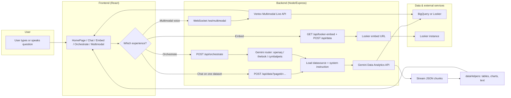

# Navigation Cheat Sheet — Conversational Analytics API Golden Demo

## 1. THE REPO'S "ELEVATOR PITCH"

**What it does:**  
This app is a **web demo** that lets people ask questions in plain language and get answers from **Looker and BigQuery** (tables, charts, text). It shows how to plug the **Conversational Analytics (CA) API** and **Gemini** into a real UI: text chat, optional voice (multimodal), embedded Looker dashboards, and a single “orchestrator” chat that picks the right dataset.

**Who it serves:**  
- **End users:** Analysts or demo attendees who want to explore data by typing (or speaking) questions.  
- **Developers:** Teams integrating the CA API or building similar “natural language to data” experiences.

---

## 2. CAPABILITY MAP (What can it do?)

| # | Capability | Plain English |
|---|------------|----------------|
| 1 | **Single-datasource chat** | User picks a dataset (e.g. OpenAQ, The Look, Cymbal Pets) and chats; every question goes to that dataset via the CA API. |
| 2 | **Orchestrated chat** | One chat where the user doesn’t pick a dataset; a Gemini “router” decides whether the question is about air quality (OpenAQ), e‑commerce (The Look), or pet retail (Cymbal Pets), then calls the CA API for that dataset. |
| 3 | **Embedded Looker + chat** | A Looker dashboard is embedded in the page; the chat next to it uses dashboard-specific instructions (and optional filter context) so answers align with the visible dashboard. |
| 4 | **Multimodal (voice + text)** | User can speak or type; the app can use the **Gemini Live API** (WebSocket) for voice and/or fall back to the same CA API used in text chat to get tables/charts. |
| 5 | **Auth and access control** | Firebase Auth restricts the app to logged-in users (e.g. your GCP org), so only allowed users see the demo. |

---

## 3. ARCHITECTURE FOR HUMANS (Tech 07)

**In one sentence:** The user interacts with the React app; the app calls the Node server, which either streams to the **Gemini Data Analytics (CA) API** (and optionally a **Gemini router**) or to the **Multimodal Live** WebSocket; data lives in **BigQuery** or **Looker**, and the server injects datasource and system instructions so the right data is queried.

---

## 4. WHERE THE "BRAIN" IS (Key file directory)

| Folder / File | What's inside (plain English) | Importance (1–5) |
|---------------|------------------------------|------------------|
| **server/index.ts** | Backend entry: defines `/api/data`, `/api/orchestrate`, `/ws/multimodal`, `/api/system-instructions`, `/api/looker-embed`, and serves the React build. | 5 |
| **server/GeminiDataAnalytics.ts** | Builds the request (messages, system instruction, datasource) and calls the **Gemini Data Analytics** “chat” endpoint; streams JSON chunks back to the client. | 5 |
| **server/GeminiOrchestrator.ts** | “Router” logic: takes the last user message, calls Gemini to choose one of openaq / thelook / cymbalpets, then forwards to the CA API with the right datasource and system instruction. | 5 |
| **server/config.ts** | Map of **pageId → datasource** (BigQuery tables or Looker explores), Looker embed URL builder, and helpers to load system instructions from Secret Manager. | 5 |
| **client/src/ChatPage.tsx** | Main chat UI: input, message list, calls `/api/data?pageId=...`, turns streamed response into text/tables/charts (via dataHelpers). | 5 |
| **client/src/OrchestratePage.tsx** | Same chat UX as ChatPage but calls `/api/orchestrate` so the backend chooses the dataset. | 4 |
| **client/src/EmbedPage.tsx** | Layout with embedded Looker dashboard + ChatPage; loads dashboard-specific system instruction from `/api/system-instructions`. | 4 |
| **client/src/Multimodal.tsx** | Multimodal UI: voice + text; uses MultimodalLiveClient (Live API or CA fallback) and renders tables/charts like ChatPage. | 4 |
| **client/src/utils/dataHelpers.ts** | Transforms raw CA API stream (JSON) into what the UI needs: tables, Vega charts, text, errors. | 5 |
| **client/src/utils/MultimodalLiveClient.ts** | Connects to `/ws/multimodal` (or uses `/api/data` for text); handles protocol, audio, and CA API fallback for structured answers. | 4 |
| **client/src/App.tsx** | Routes and auth: `/`, `/chat/:pageId`, `/chat/multimodal`, `/orchestrate`, `/resources`, `/login`; wraps with Firebase auth. | 4 |
| **client/src/ChatRouteWrapper.tsx** | Picks ChatPage vs EmbedPage and branding based on `pageId` (e.g. cymbalpets_embed → EmbedPage). | 3 |
| **secrets/** | YAML/text system instructions per page/datasource (e.g. OpenAQ, The Look, Cymbal Pets, embed dashboards, multimodal). Stored in GCP Secret Manager; loaded by server. | 5 |
| **server/authHelper.ts** | Gets a GCP access token used by the server to call Vertex/Gemini and Secret Manager. | 3 |

*Importance: **5** = core to “what the app does”; **4** = major feature; **3** = supporting.*

---

## 5. CRITICAL DEPENDENCIES

- **Google Cloud (GCP)**  
  - **Vertex AI** (Gemini models for orchestration and Multimodal Live).  
  - **Gemini Data Analytics API** (`geminidataanalytics.googleapis.com`) for the actual “chat” over data.  
  - **Secret Manager** for system instructions and Looker credentials.  
  - **App Engine** (or similar) if you deploy as in the README.

- **Firebase**  
  - **Authentication** so only signed-in users (e.g. your org) can use the app.

- **Looker**  
  - A **Looker instance** (URL, OAuth client id/secret) for Looker-backed datasources and embed URLs.  
  - Optional: **Cymbal Pets** (or your own) LookML project for the demo explores/dashboards.

- **BigQuery**  
  - Used by the CA API for OpenAQ, The Look, and (optionally) Cymbal Pets; datasets can be public or in your project.

- **Runtime**  
  - Node (e.g. v22), npm, and a React build for the client.

---

## 6. CONTROL QUESTION

**“If I had to change something in the application’s behavior, where do I start?”**

- **Change which data is queried (e.g. add a dataset, point to another Looker explore or BigQuery table)**  
  → **server/config.ts** (datasource map and, for Looker, embed domain).  
  → **secrets/** (and Secret Manager): add or edit the system instruction for that page/datasource.

- **Change how the “orchestrator” chooses a dataset (wording, allowed options, or model)**  
  → **server/GeminiOrchestrator.ts** (routing prompt and `ALLOWED` list; model/location at the top of the file).

- **Change how a question is sent to the CA API or how options (e.g. Python analysis) are set**  
  → **server/GeminiDataAnalytics.ts** (request body and URL).

- **Change how the chat looks, what’s sent in the request, or how responses are shown (tables, charts, text)**  
  → **client/src/ChatPage.tsx** (UI and call to `/api/data`).  
  → **client/src/utils/dataHelpers.ts** (mapping API stream → tables, charts, text).

- **Change multimodal/voice behavior (when to use Live vs CA, or how audio is handled)**  
  → **client/src/utils/MultimodalLiveClient.ts** and **client/src/Multimodal.tsx**.  
  → **server/index.ts** (WebSocket `/ws/multimodal` and how it forwards to Vertex).

- **Change URLs, ports, or which API routes exist**  
  → **server/index.ts**.

**Summary:** For *what data* and *how it’s chosen* → **config** + **GeminiOrchestrator** + **secrets**. For *how the chat works and looks* → **ChatPage** + **dataHelpers**. For *how the server talks to Gemini/CA* → **GeminiDataAnalytics** and **index.ts**.
